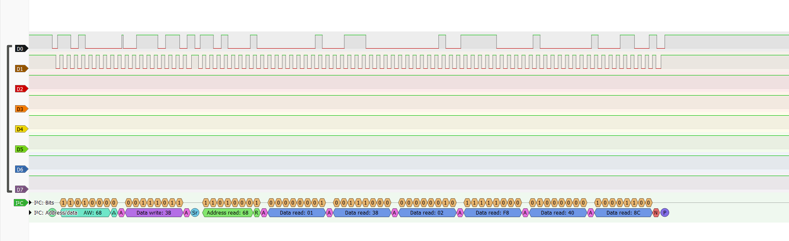

# Nucleo-F103RB
## Overview

This project implements low-level drivers for core STM32F103 peripherals, API for init/de-init, read/write, interrupt configuration, flag status, etc. It's built and debugged using **STM32CubeIDE**. MPU6050 folder contains API for nucleof103rb and mpu6050 sensor interfacing.

## Drivers implemented

| Peripheral | Header | Source |
|---|---|---|
| GPIO | `drivers/Inc/stm32f103xx_gpio_driver.h` | `drivers/Src/stm32f103xx_gpio_driver.c` |
| RCC (clocks) | `drivers/Inc/stm32f103xx_rcc_driver.h` | `drivers/Src/stm32f103xx_rcc_driver.c` |
| SPI | `drivers/Inc/stm32f103xx_spi_driver.h` | `drivers/Src/stm32f103xx_spi_driver.c` |
| I2C | `drivers/Inc/stm32f103xx_i2c_driver.h` | `drivers/Src/stm32f103xx_i2c_driver.c` |
| USART | `drivers/Inc/stm32f103xx_usart_driver.h` | `drivers/Src/stm32f103xx_usart_driver.c` |


Common register definitions and base addresses for the MCU live in `drivers/Inc/stm32f103xx.h`.
## Demo

### MPU6050
#### Demo of MPU6050 


#### Ouptut of logic analyzer using sigrok software



### Example applications (`Src/`)

| File | Description |
|---|---|
| `001_LedBlink.c` | Toggle an on-board LED using the GPIO driver | [Video Link](https://github.com/user-attachments/assets/54fc14a5-6183-47e0-9a7a-f529a35130f1).
| `002_ButtonLedInterface.c` | Read a button (on-board) and drive an LED accordingly |
| `003_ExternalButtonLedInterface.c` | Same as above using an external button |
| `004_ButtonLedInterruptInterface.c` | Button-triggered LED toggling using GPIO interrupts (EXTI) |
| `005_SPI_SendDataTesting.c` | Basic SPI data transmission test |
| `006_ArduinoSPISendOnly.c` | SPI master send to an Arduino slave |
| `007_UARTSend.c` | USART transmission, viewable via a serial terminal (e.g. PuTTY) |
| `008_I2C_ArduinoMasterSend.c` | I2C master send to an Arduino slave |

A video demonstration of the example applications running on hardware is available [here](https://drive.google.com/drive/u/1/folders/1PlHLK_qdBC3YYLz9OHBDXSHNoAvFO0gn).

## Project structure

```
stm32f1xx_drivers/
├── drivers/
│   ├── Inc/          # Driver headers + MCU register definitions (stm32f103xx.h)
│   └── Src/           # Driver implementations (GPIO, RCC, SPI, I2C, USART)
├── Src/                # Example/application source files
├── Startup/            # Startup assembly file (startup_stm32f103rbtx.s)
├── STM32F103RBTX_FLASH.ld   # Linker script
└── Debug/              # STM32CubeIDE build output (objects, .elf, .map, makefiles)
```

## Notes
- A serial terminal (e.g. PuTTY) for the USART example
- An Arduino board for the SPI/I2C slave examples
- This is a learning/reference project and is under active development — APIs may change as new peripherals and features are added.
  
